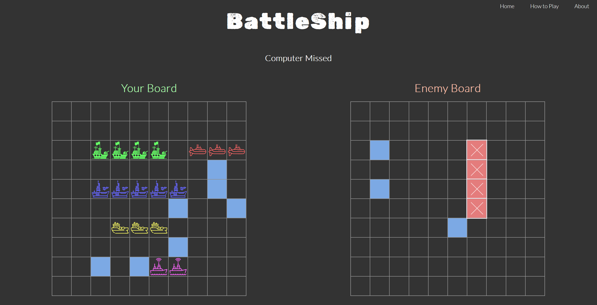

# BattleShips

# Battleship Game Website

This is a website implementation of the classic game Battleship. Players can enjoy the familiar gameplay experience of strategically placing their ships and attempting to sink their opponent's fleet.

## Table of Contents

- [Features](#features)
- [Demo](#demo)
- [Installation](#installation)
- [Usage](#usage)
- [Contributing](#contributing)
- [License](#license)

## Features

- Interactive gameplay interface with grid-based ship placement and targeting mechanism.
- Single-player mode against a computer opponent.
- Real-time feedback on hits and misses during gameplay.
- Responsive design for a seamless experience on different devices.

## Demo

[View Demo](https://yotamofri.github.io/BattleShips/)

## Installation

1. Clone the repository: git clone https://github.com/your-username/battleship.git

2. Navigate to the project directory: "cd battleship"

3. Install the required dependencies:  npm install

4. Start the local development server: open the index.html file
5. Open your web browser and visit `http://localhost:3000` to access the Battleship game website.

## Usage

- Select the game mode (single-player or multiplayer) on the homepage.
- Follow the on-screen instructions to place your ships on the grid.
- Take turns with your opponent to select a target and try to sink their ships.
- The game provides real-time feedback on hits and misses.
- Continue playing until one player successfully sinks all of their opponent's ships.
- The game will display the winner and allow you to restart or play again.

## Contributing

Contributions are welcome! If you have any suggestions, bug fixes, or feature enhancements, please open an issue or submit a pull request.

## License

This project is licensed under the [MIT License](LICENSE).
